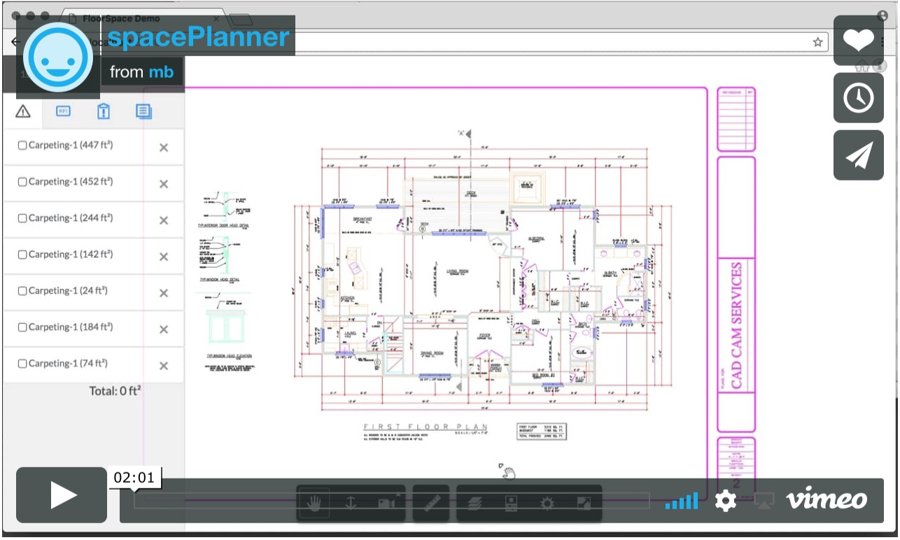

# Space Planning with Forge Measure Tool

DEMO: [https://wallabyway.github.io/area-markup/](https://wallabyway.github.io/area-markup/)

VIDEO: [https://player.vimeo.com/video/251750353](https://player.vimeo.com/video/251750353)

UPDATE to v7:
some pointers: 

- raw source code of measure Tool extension js: https://github.com/wallabyway/forge-markup-measure-extensions
- API reference: https://forge.autodesk.com/en/docs/viewer/v7/reference/Extensions/MeasureExtension/#getmeasurementlist-unittype-precision
- changing to measure tool on startup:  `viewer.getExtension('Autodesk.Measure').activate('angle');`

#### Changing Labels:

Here is the code where label text is set:  https://github.com/wallabyway/forge-markup-measure-extensions/blob/c5cd4114dd7a95dabd1e47c868a7f4cba85c4b96/Measure/MeasureToolIndicator.js#L1[…]007

``` 
setValueMeasurementLabelText(this.areaLabel.label, "~ " + this.measureTool.getArea(this.measurement));

...

// Receives an object created with createMeasurementLabel()
    function setValueMeasurementLabelText(label, strValue) {
        if (!label) return;
        var div = label.querySelector('.measure-length-text');
        div && (div.textContent = strValue);
    }
```

### Intro
The Area-measure tool inside Forge Viewer, can be used as a 'space planning' tool with a bit of tweaking.  This POC shows how to persist the Area measurements to JSON and save them as records in MySQL.  It also shows how to retrieve markups from MySQL and display them individually as layers.


- Click each layer item to turn on/off the markup areas.
- The total area is calculated at the bottom, based only on the visible layers.
- Click the delete button to remove items.
- Click 'S' button to save a new area to MySQL DB

Note: The github demo page doesn't connect to a live MySQL database (just a static copy of the data)

[](https://vimeo.com/251750353 "spacePlanner - Click to Watch!")


## Setup


1. set environment variables:

```
export MYSQL_host=XXX.rds.amazonaws.com
export MYSQL_user=XXX
export MYSQL_password=XXX`
export MYSQL_database=XXX
```

2. then, at command line:

``` node server.js ```

3. open browser at localhost:3000

## Stack

### Server

- Node.js / Express
- MySQL 
- sql scripts (stored procs, dummy data etc)


### Client
- Vue.js + Bootstrap
- Markup Data is sent from Vue.app to Forge-Viewer via events
- MeasureTool.js extension modified to 'loadJson()' and 'saveJson' 


