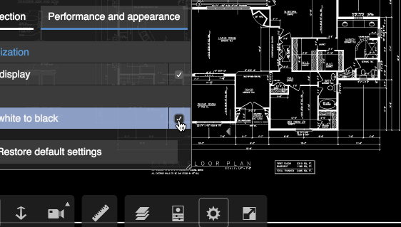

# WGS line shader modification

DEMO: [https://wallabyway.github.io/area-markup/](https://wallabyway.github.io/area-markup/)

Removed colors from 2D drawings

You still switch between black background and white-background (under settings), like this video:



Source:
wgs/render/shaders/line-vert.glsl 

~ line335 ...

```
if (swap != 0.0 )
	fsColor.rgb = vec3(1.0,1.0,1.0);
else
	fsColor.rgb = vec3(0.0,0.0,0.0);
```
